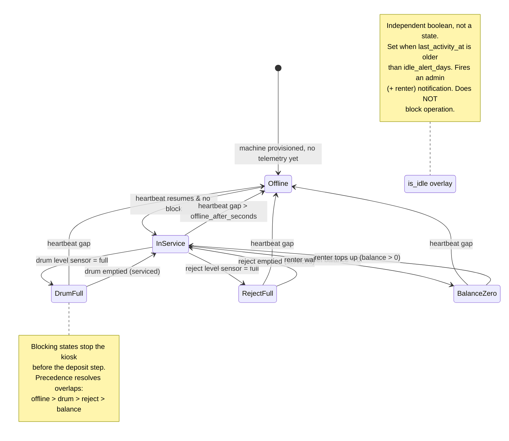
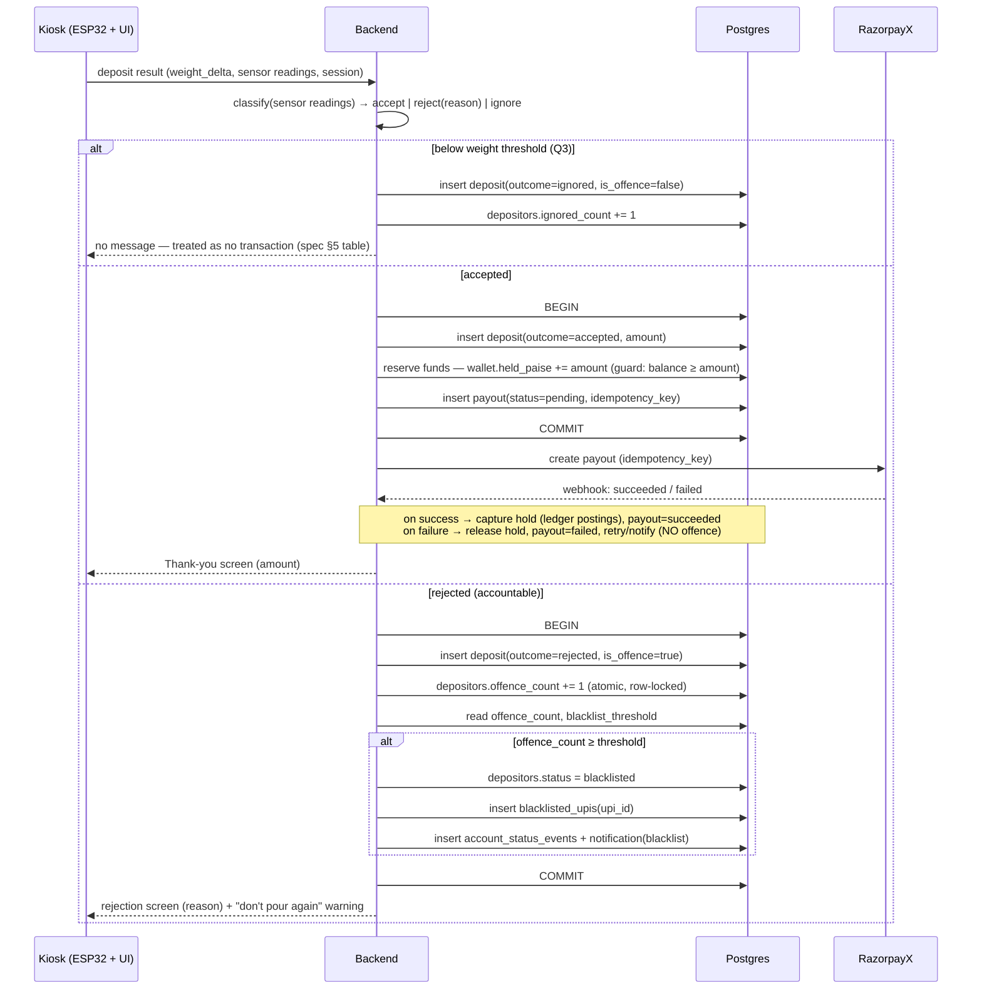

# UCO Recovery Station — Backend Design (Schema + State Machine + Fraud Flow)

**Status:** Draft for review. No application code yet.
**Source documents:**
- `UCO_Recovery_Station_Software_Requirements.md` (functional spec)
- `UCO_Recovery_Station_Software_Spec.pages` (expanded spec + implementation guide — **authoritative** where the two differ; adds kiosk hardware constraints §4 and build order §12)

---

## 0. Decisions & assumptions

### Stack
| Layer | Choice | Why |
|---|---|---|
| Database | **PostgreSQL** | Money movement (renter wallet → depositor payout) demands a transactional relational DB with a real ledger. |
| Backend API | **NestJS (TypeScript)** | Structured, one language across the whole monorepo. |
| **Kiosk app** | **Preact + Vite**, ES2017/legacy build target, plain CSS, no animation libs | Spec §4: the display is a *repurposed used tablet/phone*. React/Next is too heavy — Preact's runtime is ~4 KB, and a legacy build target tolerates the old Android WebView on whatever device is deployed. Responsive layout (device varies per site). Runs inside **Fully Kiosk Browser**, not a native app. |
| **Dashboard app** | **Next.js**, *one* app with role-based access | Spec §2 and §9.2: admin and renter are the **same** application with backend-enforced row scoping — not two apps. The public "rent a machine" marketing page is just its logged-out front door. |
| Telemetry ingest | **MQTT** broker + ingestion worker | ESP32-native, low overhead, handles intermittent connectivity. |
| Session tokens | **Redis** | Short-lived QR pairing tokens (TTL). |
| Payouts | **RazorpayX Payouts** (given) | Depositor payouts to UPI. |
| Top-ups | **Razorpay Checkout** | Renters funding their payout wallet. |

### Money representation
All monetary amounts are stored as **`BIGINT` paise (INR)**. Never floats. Weight in **grams (`INTEGER`)** to avoid float drift in payout math.

### Open-question resolutions
- **Q3 — ignore vs. offence threshold:** configurable. `machines.min_weight_delta_g` (nullable) overrides `platform_settings.default_min_weight_delta_g` (default **100 g**). Sub-threshold pours become `ignored` deposits (no offence) but are counted; excessive ignores trigger an abuse alert.
- **Q5 — rental billing:** two independent streams. (a) flat monthly **rental fee** = company revenue, billed regardless of activity; (b) renter-funded **payout wallet** = funds depositor payouts. Both required. Rental-arrears suspension policy is configurable.
- **Q1 (blacklist permanence)** and **Q2 (activity definition)** — modelled as configurable (`platform_settings`), decision left to you. Flagged in §5.

---

## 1. Database schema

Grouped by domain. Postgres DDL, lightly annotated. Enums declared inline at first use.

### 1.1 Identity & access

```sql
-- Dashboard logins: company admins and machine renters.
CREATE TYPE dashboard_role AS ENUM ('admin', 'renter');

CREATE TABLE dashboard_users (
    id            UUID PRIMARY KEY DEFAULT gen_random_uuid(),
    role          dashboard_role NOT NULL,
    email         CITEXT UNIQUE NOT NULL,
    password_hash TEXT NOT NULL,
    display_name  TEXT NOT NULL,
    phone         TEXT,
    is_active     BOOLEAN NOT NULL DEFAULT TRUE,
    created_at    TIMESTAMPTZ NOT NULL DEFAULT now(),
    updated_at    TIMESTAMPTZ NOT NULL DEFAULT now()
);

-- Depositors: the people pouring oil. Identified by phone (primary), paid via UPI.
CREATE TYPE depositor_status AS ENUM ('active', 'blacklisted');

CREATE TABLE depositors (
    id                 UUID PRIMARY KEY DEFAULT gen_random_uuid(),
    phone              TEXT UNIQUE NOT NULL,          -- primary identifier
    upi_id             TEXT NOT NULL,
    upi_verified_at    TIMESTAMPTZ,
    status             depositor_status NOT NULL DEFAULT 'active',
    offence_count      INTEGER NOT NULL DEFAULT 0,    -- cached; source of truth is deposits (§3)
    ignored_count      INTEGER NOT NULL DEFAULT 0,    -- sub-threshold pours, abuse signal
    blacklisted_at     TIMESTAMPTZ,
    blacklist_reason   TEXT,
    created_at         TIMESTAMPTZ NOT NULL DEFAULT now(),
    updated_at         TIMESTAMPTZ NOT NULL DEFAULT now()
);

-- Blacklist is enforced on the UPI ID itself, so a blacklisted user cannot
-- re-register a fresh account against the same UPI. Checked at sign-up AND pairing.
CREATE TABLE blacklisted_upis (
    upi_id        TEXT PRIMARY KEY,
    depositor_id  UUID REFERENCES depositors(id),
    reason        TEXT,
    blacklisted_at TIMESTAMPTZ NOT NULL DEFAULT now(),
    -- populated only if an appeal/reset path is enabled (Q1)
    lifted_at     TIMESTAMPTZ,
    lifted_by     UUID REFERENCES dashboard_users(id)
);

-- Returning-user auto-connect (spec §3.4): "a single tap, not a login". The
-- depositor's own phone/browser is recognised on later visits via a persistent
-- token in its localStorage, presented when the QR link opens. Never on the kiosk.
CREATE TABLE depositor_devices (
    id                UUID PRIMARY KEY DEFAULT gen_random_uuid(),
    depositor_id      UUID NOT NULL REFERENCES depositors(id),
    device_token_hash TEXT UNIQUE NOT NULL,          -- high-entropy token, hashed at rest
    user_agent        TEXT,
    last_seen_at      TIMESTAMPTZ,
    created_at        TIMESTAMPTZ NOT NULL DEFAULT now()
);
CREATE INDEX ON depositor_devices (depositor_id);

-- Immutable audit of depositor status changes (blacklist / reinstate).
CREATE TABLE account_status_events (
    id            BIGSERIAL PRIMARY KEY,
    depositor_id  UUID NOT NULL REFERENCES depositors(id),
    from_status   depositor_status,
    to_status     depositor_status NOT NULL,
    reason        TEXT,
    triggered_by  TEXT NOT NULL,                      -- 'system:offence_threshold' | 'admin:<uuid>'
    created_at    TIMESTAMPTZ NOT NULL DEFAULT now()
);
```

### 1.2 Machines, config & telemetry

```sql
CREATE TYPE machine_ownership AS ENUM ('company', 'rented');

-- The single displayed operating state (see §2 for how it is derived).
CREATE TYPE machine_effective_status AS ENUM (
    'in_service', 'drum_full', 'reject_full', 'balance_zero', 'offline'
);

CREATE TABLE machines (
    id                    UUID PRIMARY KEY DEFAULT gen_random_uuid(),
    serial_no             TEXT UNIQUE NOT NULL,
    label                 TEXT,
    location_text         TEXT,
    geo_lat               NUMERIC(9,6),
    geo_lng               NUMERIC(9,6),

    ownership             machine_ownership NOT NULL DEFAULT 'company',
    renter_id             UUID REFERENCES dashboard_users(id),   -- null when company-owned
    funding_wallet_id     UUID,                                   -- FK added after wallets (§1.4)

    rate_per_kg_paise     BIGINT NOT NULL,                        -- payout rate
    min_weight_delta_g    INTEGER,                                -- Q3 override; null → global default

    -- Latest telemetry snapshot (denormalised for fast dashboard reads;
    -- full history lives in telemetry_snapshots).
    drum_fill_pct         SMALLINT,
    reject_fill_pct       SMALLINT,
    effective_status      machine_effective_status NOT NULL DEFAULT 'offline',
    is_idle               BOOLEAN NOT NULL DEFAULT FALSE,         -- 7-day overlay (§2)
    last_telemetry_at     TIMESTAMPTZ,
    last_activity_at      TIMESTAMPTZ,                            -- drives idle check
    firmware_version      TEXT,

    total_weight_g        BIGINT NOT NULL DEFAULT 0,             -- lifetime accepted (fast read)
    total_paid_out_paise  BIGINT NOT NULL DEFAULT 0,

    deployed_at           TIMESTAMPTZ,
    created_at            TIMESTAMPTZ NOT NULL DEFAULT now(),
    updated_at            TIMESTAMPTZ NOT NULL DEFAULT now(),

    CONSTRAINT rented_has_renter
        CHECK (ownership = 'company' OR renter_id IS NOT NULL)
);

-- Time-series telemetry. High write volume → partition by month, prune per policy.
CREATE TABLE telemetry_snapshots (
    machine_id      UUID NOT NULL REFERENCES machines(id),
    ts              TIMESTAMPTZ NOT NULL,
    drum_fill_pct   SMALLINT,
    reject_fill_pct SMALLINT,
    online          BOOLEAN NOT NULL,
    raw             JSONB,                                        -- full telemetry frame
    PRIMARY KEY (machine_id, ts)
);

-- Audit of every machine status transition (§2). Lets a remote tech see history.
CREATE TABLE machine_status_events (
    id            BIGSERIAL PRIMARY KEY,
    machine_id    UUID NOT NULL REFERENCES machines(id),
    from_status   machine_effective_status,
    to_status     machine_effective_status NOT NULL,
    reason        TEXT NOT NULL,                                  -- 'telemetry:drum_full', 'wallet:balance_zero', ...
    created_at    TIMESTAMPTZ NOT NULL DEFAULT now()
);

-- Global tunables (single-row table, id = TRUE).
CREATE TABLE platform_settings (
    id                          BOOLEAN PRIMARY KEY DEFAULT TRUE CHECK (id),
    default_min_weight_delta_g  INTEGER NOT NULL DEFAULT 100,     -- Q3
    blacklist_threshold         INTEGER NOT NULL DEFAULT 3,       -- offences before blacklist
    blacklist_mode              TEXT NOT NULL DEFAULT 'permanent',-- Q1: 'permanent'|'appealable'|'auto_reset'
    blacklist_auto_reset_days   INTEGER,                          -- used only if mode='auto_reset'
    idle_alert_days             INTEGER NOT NULL DEFAULT 7,       -- §7.4
    activity_counts_rejections  BOOLEAN NOT NULL DEFAULT TRUE,    -- Q2: does a rejected attempt reset idle?
    offline_after_seconds       INTEGER NOT NULL DEFAULT 300,     -- heartbeat gap → offline
    rental_grace_days           INTEGER NOT NULL DEFAULT 7,       -- Q5: unpaid rental grace
    updated_at                  TIMESTAMPTZ NOT NULL DEFAULT now()
);
```

### 1.3 Kiosk sessions & deposits

```sql
CREATE TYPE deposit_outcome AS ENUM ('accepted', 'rejected', 'ignored');

CREATE TYPE rejection_reason AS ENUM (
    'not_oil',            -- capacitance: no oil signature (water etc.)
    'water_contaminated', -- capacitance: partial water above threshold
    'low_quality',        -- color sensor: burnt/foreign liquid
    'below_threshold'     -- weight delta < min → outcome 'ignored', NOT an offence
);

-- One row per kiosk visit. QR pairing token lives in Redis; this is the durable record.
CREATE TABLE kiosk_sessions (
    id            UUID PRIMARY KEY DEFAULT gen_random_uuid(),
    machine_id    UUID NOT NULL REFERENCES machines(id),
    depositor_id  UUID REFERENCES depositors(id),   -- null until phone pairs
    language      TEXT,
    started_at    TIMESTAMPTZ NOT NULL DEFAULT now(),
    paired_at     TIMESTAMPTZ,
    ended_at      TIMESTAMPTZ
);

-- Every deposit attempt: accepted, rejected, or ignored. This is the transaction log
-- required by §4.3 and the source of truth for offence counting (§3).
CREATE TABLE deposits (
    id                 UUID PRIMARY KEY DEFAULT gen_random_uuid(),
    session_id         UUID NOT NULL REFERENCES kiosk_sessions(id),
    machine_id         UUID NOT NULL REFERENCES machines(id),
    depositor_id       UUID NOT NULL REFERENCES depositors(id),

    outcome            deposit_outcome NOT NULL,
    rejection_reason   rejection_reason,                 -- non-null when outcome != 'accepted'
    is_offence         BOOLEAN NOT NULL DEFAULT FALSE,    -- true only for accountable rejections

    weight_delta_g     INTEGER NOT NULL,
    rate_per_kg_paise  BIGINT,                            -- snapshot at time of deposit
    amount_paise       BIGINT,                            -- accepted only: rate × weight

    sensor_readings    JSONB NOT NULL,                    -- full raw readings behind the decision
    payout_id          UUID,                              -- FK added after payouts (§1.4)
    funded_wallet_id   UUID,                              -- which wallet paid (renter or company)

    created_at         TIMESTAMPTZ NOT NULL DEFAULT now(),

    CONSTRAINT accepted_has_amount
        CHECK (outcome <> 'accepted' OR amount_paise IS NOT NULL),
    CONSTRAINT rejected_has_reason
        CHECK (outcome = 'accepted' OR rejection_reason IS NOT NULL),
    CONSTRAINT offence_only_when_rejected
        CHECK (NOT is_offence OR outcome = 'rejected')
);

CREATE INDEX ON deposits (depositor_id, created_at);
CREATE INDEX ON deposits (machine_id, created_at);
```

### 1.4 Money: wallets, ledger, payouts, rental

Double-entry ledger. Every rupee that moves is a balanced journal entry (debits = credits). `wallets.balance_paise` is a cache reconciled from `ledger_postings`.

```sql
CREATE TYPE wallet_owner_type AS ENUM ('renter', 'company');

CREATE TABLE wallets (
    id            UUID PRIMARY KEY DEFAULT gen_random_uuid(),
    owner_type    wallet_owner_type NOT NULL,
    owner_id      UUID,                               -- renter's dashboard_user id; null for company wallet
    balance_paise BIGINT NOT NULL DEFAULT 0,          -- cached; = sum of postings
    held_paise    BIGINT NOT NULL DEFAULT 0,          -- reserved for in-flight payouts
    created_at    TIMESTAMPTZ NOT NULL DEFAULT now(),
    UNIQUE (owner_type, owner_id)
);

-- Now wire the deferred FKs from §1.2 / §1.3.
ALTER TABLE machines
    ADD CONSTRAINT machines_funding_wallet_fk
    FOREIGN KEY (funding_wallet_id) REFERENCES wallets(id);

-- A journal entry = one financial event; its postings must net to zero.
CREATE TYPE ledger_reason AS ENUM (
    'topup', 'payout_hold', 'payout_capture', 'payout_release',
    'rental_fee', 'adjustment', 'reversal'
);

CREATE TABLE ledger_journal (
    id          BIGSERIAL PRIMARY KEY,
    reason      ledger_reason NOT NULL,
    ref_type    TEXT,                                 -- 'payout' | 'topup' | 'rental_invoice' ...
    ref_id      UUID,
    created_at  TIMESTAMPTZ NOT NULL DEFAULT now()
);

CREATE TABLE ledger_postings (
    id            BIGSERIAL PRIMARY KEY,
    journal_id    BIGINT NOT NULL REFERENCES ledger_journal(id),
    wallet_id     UUID NOT NULL REFERENCES wallets(id),
    amount_paise  BIGINT NOT NULL,                    -- +credit / -debit
    balance_after BIGINT NOT NULL,                    -- running balance for this wallet
    created_at    TIMESTAMPTZ NOT NULL DEFAULT now()
);
CREATE INDEX ON ledger_postings (wallet_id, id);

-- Renter top-ups via Razorpay Checkout.
CREATE TYPE topup_status AS ENUM ('created', 'succeeded', 'failed');

CREATE TABLE wallet_topups (
    id                  UUID PRIMARY KEY DEFAULT gen_random_uuid(),
    wallet_id           UUID NOT NULL REFERENCES wallets(id),
    amount_paise        BIGINT NOT NULL,
    status              topup_status NOT NULL DEFAULT 'created',
    razorpay_order_id   TEXT UNIQUE,
    razorpay_payment_id TEXT,
    journal_id          BIGINT REFERENCES ledger_journal(id),
    created_at          TIMESTAMPTZ NOT NULL DEFAULT now(),
    updated_at          TIMESTAMPTZ NOT NULL DEFAULT now()
);

-- Depositor payouts via RazorpayX. Hold → capture/release pattern for correctness.
CREATE TYPE payout_status AS ENUM (
    'pending', 'processing', 'succeeded', 'failed', 'reversed'
);

CREATE TABLE payouts (
    id                  UUID PRIMARY KEY DEFAULT gen_random_uuid(),
    deposit_id          UUID NOT NULL UNIQUE REFERENCES deposits(id),
    depositor_id        UUID NOT NULL REFERENCES depositors(id),
    wallet_id           UUID NOT NULL REFERENCES wallets(id),   -- funding source
    upi_id              TEXT NOT NULL,                          -- snapshot at payout time
    amount_paise        BIGINT NOT NULL,
    status              payout_status NOT NULL DEFAULT 'pending',
    idempotency_key     TEXT UNIQUE NOT NULL,                   -- RazorpayX dedupe
    razorpayx_payout_id TEXT,
    failure_reason      TEXT,
    created_at          TIMESTAMPTZ NOT NULL DEFAULT now(),
    updated_at          TIMESTAMPTZ NOT NULL DEFAULT now()
);

ALTER TABLE deposits
    ADD CONSTRAINT deposits_payout_fk FOREIGN KEY (payout_id) REFERENCES payouts(id);

-- Q5 stream (a): flat monthly rental, independent of the payout wallet.
CREATE TYPE agreement_status AS ENUM ('active', 'suspended', 'terminated');

CREATE TABLE rental_agreements (
    id               UUID PRIMARY KEY DEFAULT gen_random_uuid(),
    renter_id        UUID NOT NULL REFERENCES dashboard_users(id),
    machine_id       UUID NOT NULL REFERENCES machines(id),
    monthly_fee_paise BIGINT NOT NULL,
    status           agreement_status NOT NULL DEFAULT 'active',
    start_date       DATE NOT NULL,
    end_date         DATE,
    next_bill_date   DATE NOT NULL,
    created_at       TIMESTAMPTZ NOT NULL DEFAULT now()
);

CREATE TYPE invoice_status AS ENUM ('due', 'paid', 'overdue', 'waived');

CREATE TABLE rental_invoices (
    id            UUID PRIMARY KEY DEFAULT gen_random_uuid(),
    agreement_id  UUID NOT NULL REFERENCES rental_agreements(id),
    period_start  DATE NOT NULL,
    period_end    DATE NOT NULL,
    amount_paise  BIGINT NOT NULL,
    status        invoice_status NOT NULL DEFAULT 'due',
    due_date      DATE NOT NULL,
    paid_at       TIMESTAMPTZ,
    created_at    TIMESTAMPTZ NOT NULL DEFAULT now()
);
```

### 1.5 Notifications / alerts

```sql
CREATE TYPE notification_type AS ENUM (
    'drum_full', 'reject_full', 'balance_zero', 'idle_7day',
    'offline', 'blacklist', 'excessive_ignores', 'rental_overdue', 'payout_failed'
);

CREATE TABLE notifications (
    id            UUID PRIMARY KEY DEFAULT gen_random_uuid(),
    type          notification_type NOT NULL,
    machine_id    UUID REFERENCES machines(id),
    depositor_id  UUID REFERENCES depositors(id),
    target_role   dashboard_role NOT NULL,            -- who should see it
    target_user   UUID REFERENCES dashboard_users(id),-- null = all of that role (e.g. all admins)
    payload       JSONB,
    resolved_at   TIMESTAMPTZ,
    created_at    TIMESTAMPTZ NOT NULL DEFAULT now()
);
```

---

## 2. Machine status — formal state machine (§8)

### 2.1 The key modelling decision

Section 8's six "states" are **not one flat FSM** — they live on three independent axes, and collapsing them loses information a remote technician needs:

| Axis | Values | Source |
|---|---|---|
| **Connectivity** | `online` / `offline` | telemetry heartbeat vs. `offline_after_seconds` |
| **Availability** (blocking) | `available` / `drum_full` / `reject_full` / `balance_zero` | telemetry level sensors + wallet balance |
| **Idle overlay** | `is_idle` boolean | `last_activity_at` vs. `idle_alert_days` |

Two conditions can be true at once (e.g. a machine whose drum filled up *and* then went offline). So the design keeps the axes separate and derives **one `effective_status`** for display via a fixed precedence. Idle is a **flag layered on top**, never a state that replaces the others.

### 2.2 Effective-status precedence

```
offline > drum_full > reject_full > balance_zero > in_service
```

- `offline` wins because when telemetry is stale we cannot trust level or balance readings.
- Physical blocks (`drum_full`, `reject_full`) rank above the financial block (`balance_zero`): if the drum is full, no deposit is possible regardless of balance.
- `is_idle` is computed independently and shown as a badge alongside whatever the effective status is.

Only `in_service` (online + no block) lets the kiosk advance past QR to the deposit step.

### 2.3 State diagram



### 2.4 Transition table

| From | Event / trigger | Guard | Effect | To |
|---|---|---|---|---|
| any | telemetry frame received | — | update snapshot, `last_telemetry_at` | recompute (below) |
| online + available | drum sensor reports full | drum ≥ capacity | block deposits; kiosk shows "machine full" msg | `drum_full` |
| `drum_full` | drum sensor reports not-full | serviced | unblock | recompute |
| online + available | reject sensor reports full | reject ≥ capacity | block deposits; kiosk shows distinct "needs servicing" msg | `reject_full` |
| `reject_full` | reject sensor not-full | serviced | unblock | recompute |
| online + available | wallet balance hits 0 | ownership='rented' | block deposits; kiosk shows "temporarily unavailable" | `balance_zero` |
| `balance_zero` | renter top-up posts | balance > 0 | unblock | recompute |
| any | no heartbeat in `offline_after_seconds` | — | mark offline; suppress level/balance trust | `offline` |
| `offline` | heartbeat resumes | — | re-evaluate blocks from fresh telemetry | recompute |
| any online | `now - last_activity_at > idle_alert_days` | — | set `is_idle=true`; emit `idle_7day` notification | (overlay only) |
| any | accepted **or** (rejected if `activity_counts_rejections`) deposit | — | update `last_activity_at`; clear `is_idle` | (overlay only) |

**`recompute(machine)`** = apply the §2.2 precedence over the current axis values, write a `machine_status_events` row if `effective_status` changed, and fire/resolve the matching notification.

- Company-owned machines can never enter `balance_zero` (they draw from the company wallet, treated as always funded / negative-allowed per your policy).
- `balance_zero` is intentionally distinct from `drum_full`/`reject_full`/`offline` on the dashboard, per §7.3, so renter and admin see *why* a machine stopped.

---

## 3. Fraud / offence-tracking data flow (§4)

### 3.1 Where the count lives, and why

`deposits` is the source of truth. An **offence = a `deposits` row with `is_offence = true`**. `depositors.offence_count` is a cache updated in the same DB transaction that inserts the deposit, so it can never drift from the ledger of deposits. The blacklist is enforced on the **UPI ID** (via `blacklisted_upis`) so a blacklisted user can't re-register a new account against the same UPI.

### 3.2 The two gates

1. **Ignore gate (Q3):** `weight_delta_g < effective_min_threshold` → `outcome = 'ignored'`, `is_offence = false`. Increments `ignored_count`, not `offence_count`. This protects honest users from accidental drips — but ignores are still counted so abuse (repeated sub-threshold pours) surfaces as an `excessive_ignores` alert.
2. **Offence gate:** a genuine rejection (not oil / contaminated / low quality) with `weight_delta_g ≥ threshold` → `outcome = 'rejected'`, `is_offence = true`, increment `offence_count`, then evaluate the blacklist threshold.

`effective_min_threshold = machines.min_weight_delta_g ?? platform_settings.default_min_weight_delta_g`.

### 3.3 Sequence



### 3.4 Blacklist enforcement point

Enforced at **session pairing** (spec §2.3 / §2.4), *before* the deposit step:

```
QR scanned → resolve depositor by phone/UPI
  → if depositor.status = 'blacklisted'  OR  upi_id ∈ blacklisted_upis
       → block: show "account restricted" message, do NOT advance to deposit
  → else → proceed (returning user auto-connect, or first-time sign-up)
```

Sign-up also checks `blacklisted_upis` so a blacklisted UPI can't create a fresh account.

### 3.5 Correctness notes

- **Atomicity:** deposit insert + `offence_count` increment + blacklist decision run in one transaction with a `SELECT … FOR UPDATE` on the depositor row, so two near-simultaneous rejections can't both read a stale count and skip the blacklist.
- **Payout ≠ offence coupling:** a *failed payout on an accepted deposit* is a money problem, retried via idempotency key — never logged as an offence. Only sensor-driven rejections are offences.
- **Configurable reset (Q1):** `blacklist_mode` decides whether `blacklisted_upis` rows are permanent, admin-liftable (`lifted_at`/`lifted_by`), or auto-expire after `blacklist_auto_reset_days`. Reinstatement writes an `account_status_events` row.
- **Wallet guard:** the reserve step refuses if `balance_paise - held_paise < amount`; that condition is also what flips a rented machine to `balance_zero` (§2).

### 3.6 Payout confirmation timing (spec §3.6)

The spec requires the Thank-You screen only *after* RazorpayX confirms the payout was **successfully initiated** — never before. That's a deliberate distinction from *settled*, and it maps onto the hold/capture design:

| Moment | Payout status | Wallet | Kiosk shows |
|---|---|---|---|
| deposit accepted, funds reserved | `pending` | hold placed | "processing / verifying" |
| RazorpayX create-payout returns 2xx | `processing` | hold still held | **Thank-You + amount** ✅ |
| settlement webhook: success | `succeeded` | hold captured → ledger postings | (user has left) |
| settlement webhook: failure | `failed` | hold released, balance restored | (user has left) |

The kiosk must not block on final settlement — UPI is usually seconds but not guaranteed, and a depositor cannot be made to stand at the machine waiting. A post-hoc settlement failure is resolved by retry (same `idempotency_key`) plus a `payout_failed` notification to admin, and **never** becomes an offence against the depositor.

### 3.7 Where the accept/reject decision runs

Spec §3.5 and §5 are explicit: the kiosk **must not** classify locally. The ESP32 reports raw sensor readings; the backend applies calibrated thresholds and returns the verdict plus rejection reason, which the kiosk renders in the selected language. This keeps the decision consistent across the fleet and updatable in one place — which is exactly why thresholds live in `platform_settings` / `machines.min_weight_delta_g` rather than in device firmware or kiosk JS.

---

## 4. How the pieces connect (quick map)

- **Kiosk flow (§2 of spec)** → `kiosk_sessions` + `deposits`, gated by depositor `status` and machine `effective_status`.
- **Sensor rejection logic (§3)** → `deposits.rejection_reason` + `sensor_readings` jsonb.
- **Fraud (§4)** → §3 above.
- **Telemetry (§5)** → `telemetry_snapshots` (history) + denormalised columns on `machines`.
- **Dashboards (§6/§7)** → reads over `machines`, `wallets`, `rental_agreements`, `deposits` aggregates; renter scoping via `machines.renter_id = current_user`.
- **Wallet + rental (§7, Q5)** → `wallets`/`ledger_*`/`wallet_topups` (payout stream) and `rental_agreements`/`rental_invoices` (flat-fee stream), fully separate.

---

## 5. Open items I need you to confirm

The expanded spec (§11) still lists all five original open questions as undecided. It does, however, **corroborate** the two you asked me to resolve: its §5 table confirms sub-threshold pours get "no message… not logged as an offence" (Q3 behaviour settled, *number* still open), and its §11 notes the requirements "treat these as two separate things" for rental fee vs. wallet (Q5 leaning my way, not confirmed). So the items below stand:

1. **Q1 — blacklist permanence:** modelled as configurable (`permanent` / `appealable` / `auto_reset`). Which is the default policy?
2. **Q2 — idle activity definition:** modelled as `activity_counts_rejections` (default TRUE = any attempt counts). Should a *rejected* attempt reset the 7-day idle clock, or only accepted deposits?
3. **Q4 — renter branding on kiosk:** not yet in schema. If depositor-facing branding can differ per renter, I'll add a `branding` jsonb / theme ref to `machines` or `rental_agreements`. Identical for now?
4. **Company wallet policy:** I've assumed company-owned machines never hit `balance_zero` (company wallet always funds). Confirm, or set a floor.
5. **Threshold defaults:** `default_min_weight_delta_g = 100 g`, `blacklist_threshold = 3`, `offline_after_seconds = 300`, `idle_alert_days = 7`. Adjust any.

---

## 6. Build order (spec §12) mapped to this schema

The spec's recommended sequence, annotated with which tables each step needs — so nothing gets built before its foundation exists.

| # | Spec step | Tables required |
|---|---|---|
| 1 | Core data model | `machines`, `depositors`, `dashboard_users`, `kiosk_sessions`, `deposits`, `platform_settings` |
| 2 | Minimal kiosk, **simulated** sensor data | above + `depositor_devices` (auto-connect) |
| 3 | Real RazorpayX payouts | `wallets`, `ledger_journal`, `ledger_postings`, `payouts` |
| 4 | Offence counting + blacklist | `blacklisted_upis`, `account_status_events` (+ `deposits.is_offence`) |
| 5 | Admin dashboard | reads only — no new tables |
| 6 | Renter accounts, wallet, scoped view | `wallet_topups`, `rental_agreements`, `rental_invoices` |
| 7 | Idle notifications (last) | `notifications`, `machines.last_activity_at` |

Note step 2 builds the kiosk against **fake sensor data** before hardware is ready. That works cleanly here because the accept/reject decision is a backend function over `sensor_readings` (§3.7) — the kiosk never knows whether the readings came from an ESP32 or a test fixture.
```
